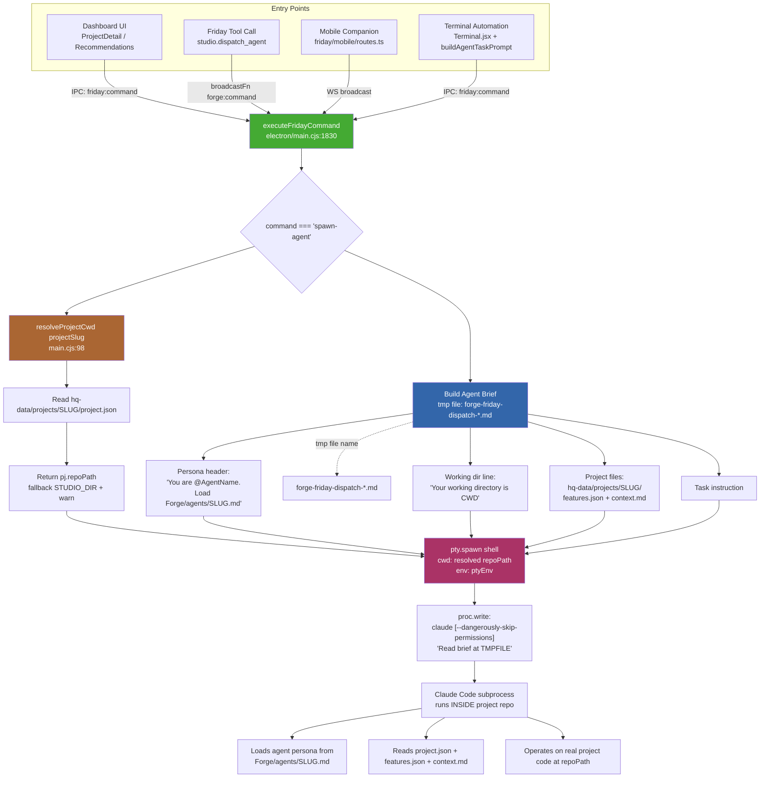

# Agent Launch Flow

How agent launches converge on a single Electron handler that injects **persona + working directory + project files** for every dispatch.

## Flow Diagram

## The Three Guarantees

Every launch path converges on `executeFridayCommand('spawn-agent', ...)` in `Forge/electron/main.cjs:1834`, which enforces:

| Guarantee | Where | Code |
|---|---|---|
| **Persona** | Brief tmp file references `Forge/agents/{slug}.md` | main.cjs:1910-1911 |
| **Working Directory** | `resolveProjectCwd(projectSlug)` reads `project.json.repoPath` | main.cjs:98-111, 1850 |
| **Project Files** | Brief instructs agent to read `hq-data/projects/{slug}/features.json` + `context.md` | main.cjs:1915-1916 |

## Entry Point → Handler Map

| Entry Point | File | Path to Handler |
|---|---|---|
| Dashboard launch button | `src/components/dashboard/*` | `useStore.js` → IPC `friday:command` → `executeFridayCommand` |
| Friday LLM tool | `friday/src/modules/studio/dispatch-agent.ts:73` | `broadcastFn({type:'forge:command'})` → server WS → Electron → `executeFridayCommand` |
| Mobile companion | `friday/src/modules/mobile/routes.ts` | WS broadcast → Electron → `executeFridayCommand` |
| Terminal automation | `src/components/Terminal.jsx:328` | `buildAgentTaskPrompt` → IPC → `executeFridayCommand` |

## Single Point of Truth

Because all paths funnel through `resolveProjectCwd` and the same brief-builder, fixing the cwd resolution in one place fixes it for **every** entry point — dashboard, Friday, mobile, and automation.

## Known Gap

**Fixed:** `dispatch-agent.ts` previously pointed `AGENTS_DIR` at the legacy Forge path and the standalone `Bun.spawn` fallback hardcoded `cwd: "C:/Claude/Samurai"`. Both now resolve to Forge paths (`Forge/agents/` and `projectInfo.repoPath`).
