<div align="center">
<br />


<br />

# F.R.I.D.A.Y.

**Female Replacement Intelligent Digital Assistant Youth**

An autonomous AI agent runtime inspired by Tony Stark's companion.
TUI-first. Module-driven. Built to think, remember, and adapt.

<br />

[](https://bun.sh)
[](https://www.typescriptlang.org)
[]()
[](https://biomejs.dev)

<br />
</div>

---

Friday is an **agent runtime**, not a chatbot wrapper. She loads capabilities as **Modules**, executes **Protocols** on command, follows **Directives** autonomously, learns through **SMARTS** dynamic knowledge, monitors her environment via **Sensorium**, and remembers everything through persistent **Memory** — all within **Clearance** boundaries and a full **Audit** trail.

Built on [Bun](https://bun.sh) and TypeScript. Powered by the [Vercel AI SDK](https://sdk.vercel.ai) with xAI Grok.

---

## Quick Start

```bash
# Clone and install
git clone <repo-url> && cd friday
bun install

# Configure your API key
cp .env.example .env
# Edit .env — add XAI_API_KEY

# Start the server
bun run serve &

# Connect with the TUI
bun run start chat
```

Friday's server starts first, then the TUI connects to it. Type natural language to converse, `/command` to invoke a protocol, or `exit` to end the session.

---

## What's Inside

### 🧠 Cortex — The Brain

Cortex is Friday's LLM reasoning engine — the central intelligence that processes every non-protocol message. Built on the Vercel AI SDK v6, it uses `streamText()` with automatic tool execution via `stopWhen: stepCountIs(N)`. It exposes both `chat()` (blocking) and `chatStream()` (native streaming) methods. `HistoryManager` handles token-budget-aware conversation history with automatic compaction.

Every message Friday receives triggers a sophisticated pipeline: the system prompt is dynamically enriched with pinned SMARTS knowledge, FTS5-matched knowledge relevant to the current message, and a compact Sensorium environment context block — all before the LLM ever sees it. This means Friday's responses are always informed by what she's learned and what's happening on the machine.

Friday uses a **dual-model architecture**: a reasoning model (Grok) handles conversations, while a fast model handles utility tasks like summarization and knowledge extraction.

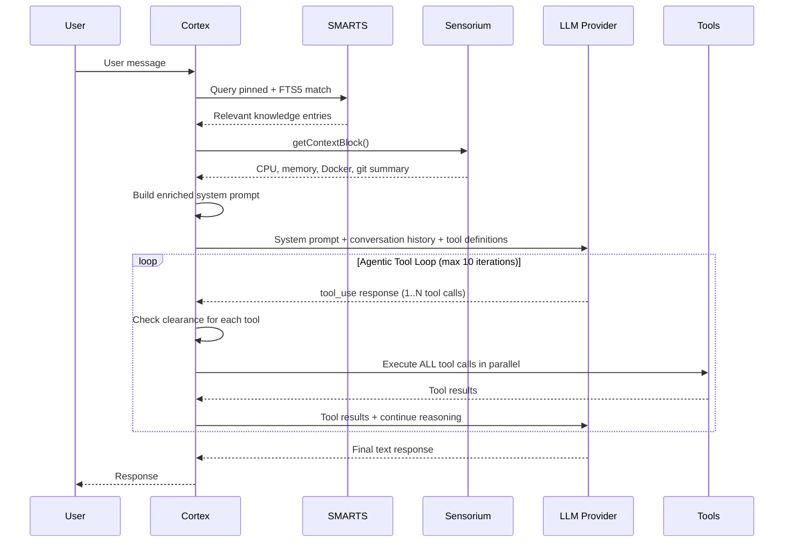

**Error recovery** is built into the loop: if the LLM fails *before* any tools run, Cortex rolls back the conversation history to its pre-call state. If tools have already executed (with side effects), the partial conversation state is preserved to maintain consistency.

| Feature | Detail |
|---|---|
| Parallel tool execution | All tool calls in a single LLM response execute via `Promise.all()` |
| Clearance gates | Every tool call checks `ClearanceManager.checkAll()` before execution |
| Max iteration guard | Configurable cap (default 10) prevents runaway tool loops |
| Prompt enrichment | SMARTS knowledge + Sensorium context injected per-message |
| Dual-model | Reasoning model for chat, fast model for summarization & extraction |

---

### 📚 SMARTS — Dynamic Knowledge

SMARTS (Smart Memory And Runtime Training System) is how Friday **learns from conversations and carries that knowledge forward**. It's not static documentation — it's a living knowledge base that grows, self-curates, and decays gracefully.

Knowledge entries are markdown files with YAML frontmatter, indexed into SQLite via FTS5 full-text search. Each entry carries a domain, tags, confidence score, source attribution, and a session ID for staleness tracking. On every message, Cortex queries SMARTS for relevant knowledge and injects it into the system prompt — so Friday genuinely *knows* things she learned last Tuesday.

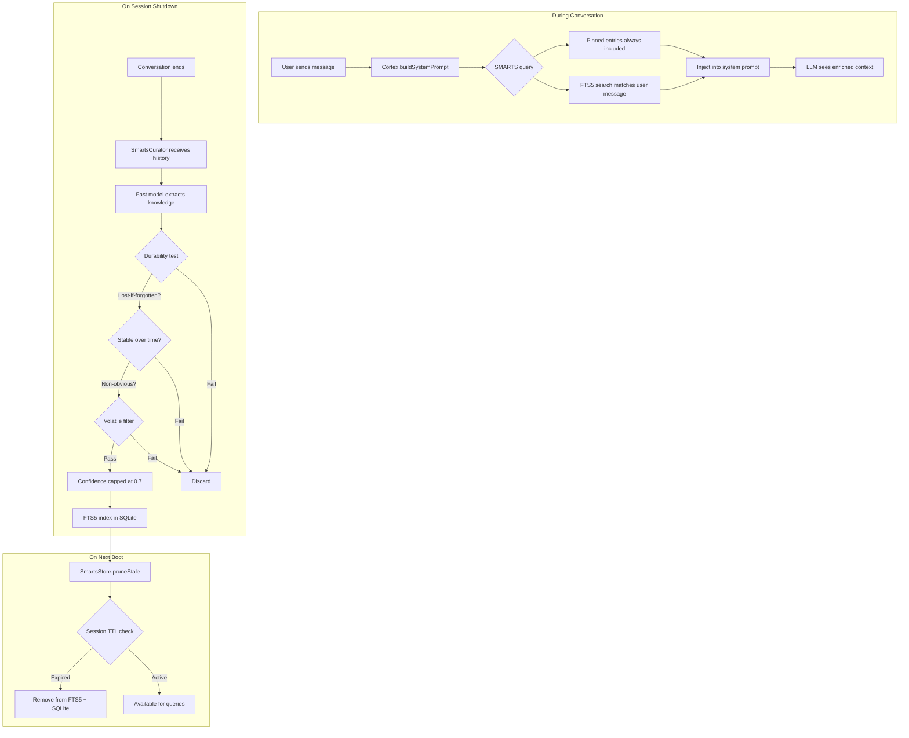

The **SmartsCurator** applies a strict three-gate durability test before accepting any extraction:

1. **Lost-if-forgotten** — Can't be rediscovered from source code, CLAUDE.md, or docs
2. **Stable over time** — Will still be accurate 10+ sessions from now
3. **Non-obvious** — A senior developer wouldn't independently arrive at this insight

Volatile content (system stats, tool counts, port listings, test counts) is filtered via regex patterns before it ever reaches the store. Confidence is hard-capped at 0.7 for auto-extracted knowledge — only human-authored or human-verified entries can score higher.

`/smart list` · `/smart search <query>` · `/smart domains` · `/smart show <name>`

---

### 🌡️ Sensorium — Environmental Awareness

Sensorium is Friday's **sensory nervous system** — she always knows what machine she's running on, what's happening with resources, which Docker containers are up, and what the git state looks like. This context is injected into every system prompt so Friday can make informed decisions without being asked.

The system uses **dual-cadence polling** to balance freshness with efficiency: fast-changing metrics poll every 30 seconds, while slow-changing state polls every 5 minutes.

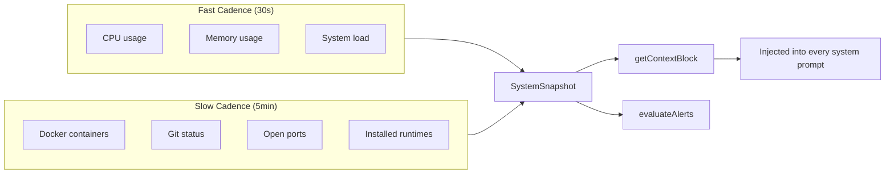

Alerts use **hysteresis** — they fire on *state transitions*, not on every poll tick. This means you get one `custom:env-memory-high` signal when memory crosses the threshold, not a flood every 30 seconds. CPU alerts additionally require **two consecutive high readings** to filter out momentary spikes.

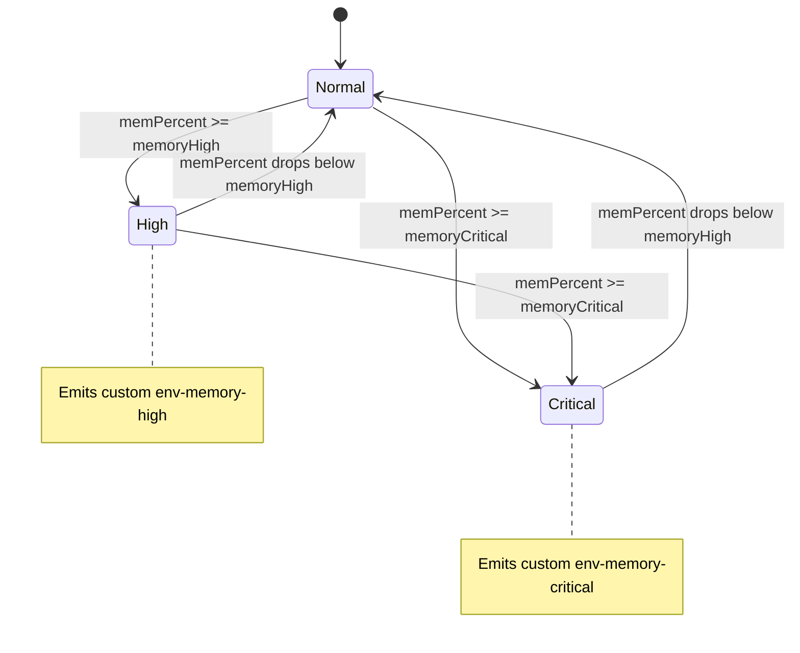

CPU alerts additionally require **two consecutive high readings** to filter out momentary spikes:

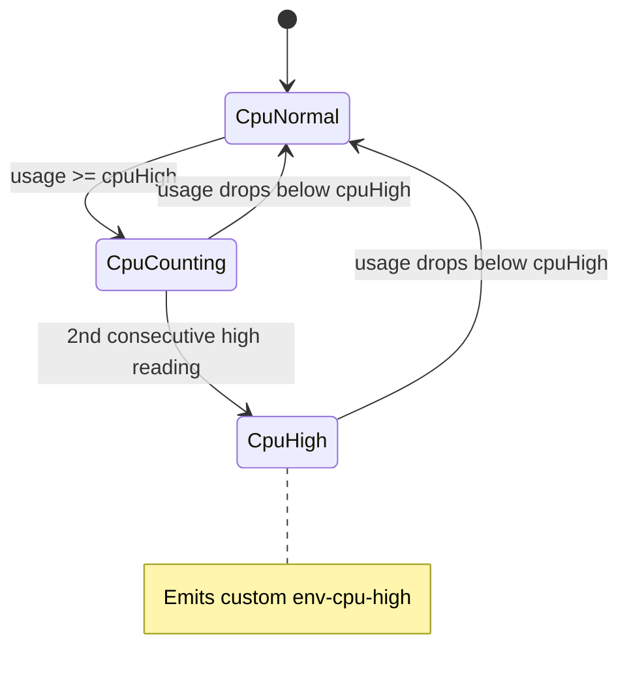

When a state transition occurs, Sensorium emits a typed signal on the SignalBus *and* dispatches a notification through the NotificationManager — both the reactive and the alerting systems are triggered simultaneously.

| Sensor | Source | Cadence | Signals |
|---|---|---|---|
| CPU usage | `node:os` cpus delta | 30s | `custom:env-cpu-high` |
| Memory | `node:os` freemem/totalmem | 30s | `custom:env-memory-high`, `custom:env-memory-critical` |
| Docker | `Bun.$` docker ps | 5min | `custom:env-container-down` |
| Git | `Bun.$` git status | 5min | -- |
| Ports | `Bun.$` lsof | 5min | -- |

`/env status` · `/env cpu` · `/env memory` · `/env docker` · `/env git` · `/env ports`

---

### 📁 Modules — Capabilities

Modules are Friday's **hands on the keyboard** — each one bundles tools, protocols, knowledge, signal triggers, and clearance requirements into a discoverable unit. They're auto-loaded from the filesystem at boot, validated against the manifest contract, and given scoped memory instances for persistent state.

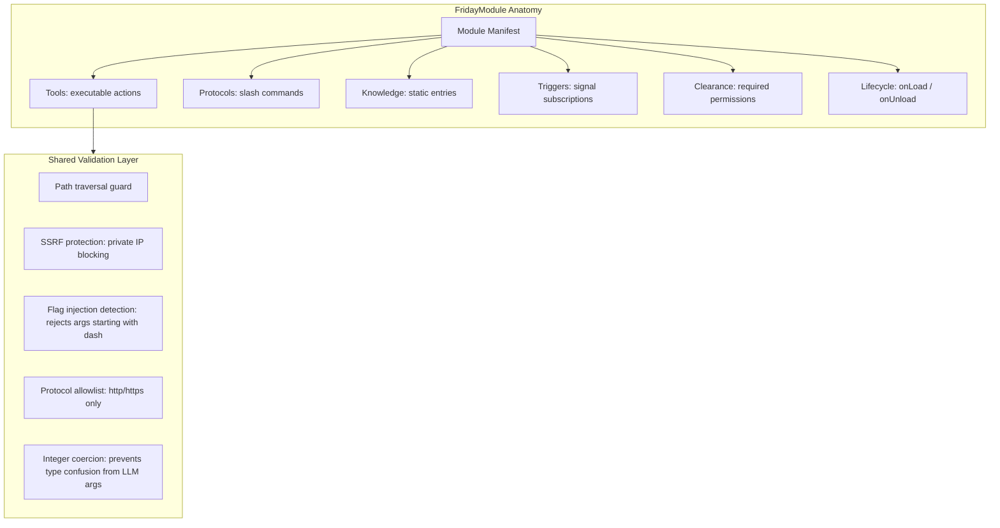

Eight operational modules ship with Friday:

| Module | Tools | Clearance | Security |
|---|---|---|---|
| **Filesystem** | read, write, list, delete, exec | `read-fs`, `write-fs`, `delete-fs`, `exec-shell` | Path traversal guard |
| **Git** | status, diff, log, branch, stash, push, pull | `git-read`, `git-write` | Flag injection protection |
| **Docker** | ps, logs, inspect, stats, exec | `exec-shell` | Command injection guards |
| **Code Exec** | run (sandboxed script execution) | `exec-shell` | Timeout enforcement |
| **Web Fetch** | fetch (HTTP requests) | `network` | SSRF protection (private IP blocking) |
| **Notify** | send (multi-channel dispatch) | -- | Channel validation |
| **Forge** | propose, apply, validate, restart, status | `write-fs`, `read-fs`, `exec-shell`, `system`, `forge-modify` | Core module protection, LLM artifact sanitization |
| **Gmail** | search, read, send, reply, modify, list_labels | `network`, `email-send` | OAuth 2.0, encrypted token storage |

Every tool call flows through the same pipeline: Cortex receives a `tool_use` from the LLM → checks clearance via `ClearanceManager.checkAll()` → calls `tool.execute()` with a `ToolContext` (working directory, audit logger, signal emitter, scoped memory) → returns the result to the LLM.

---

### 🧩 Deja Vu — Conversational Memory Recall

Deja Vu gives Friday **long-term conversational memory**. She doesn't just remember the current session — she can search across all past conversations, find when something was discussed, and pull up the full transcript. The `recall_memory` tool is registered in Cortex at boot, so the LLM can autonomously decide to search its memory when a user references something from a prior session.

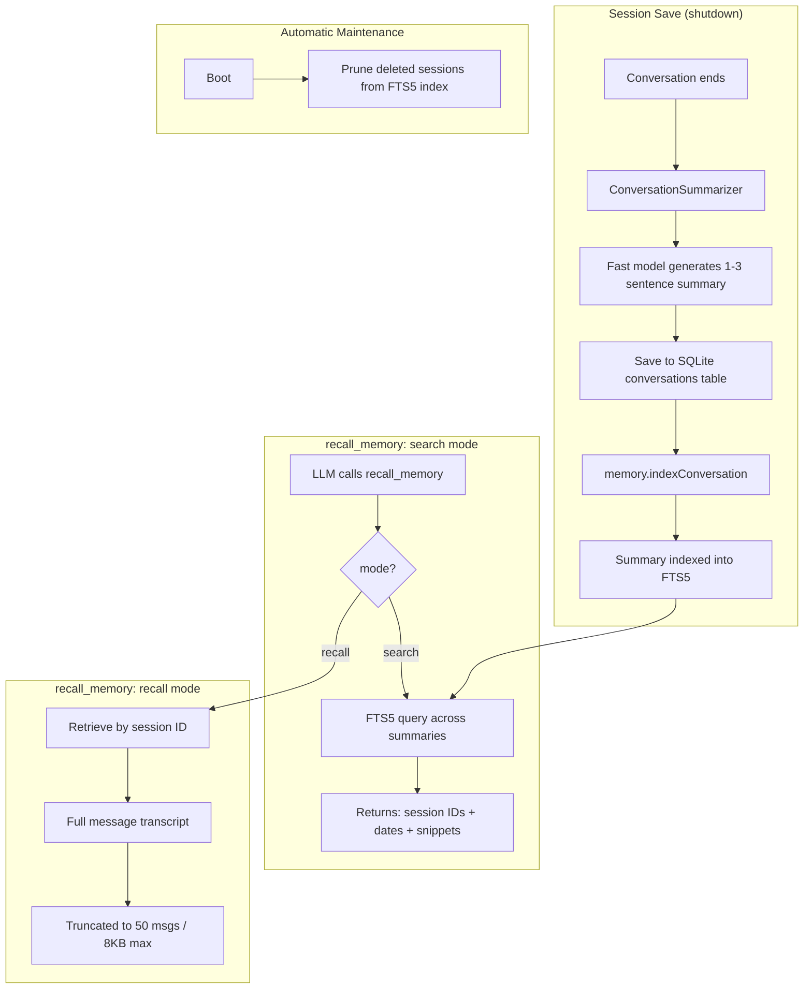

The two-step flow is intentional: **search** finds relevant sessions cheaply (just FTS5 over summaries), then **recall** retrieves the full transcript only for the sessions that matter. This keeps token usage low while giving Friday genuine long-term memory.

---

### 🔨 The Forge — Self-Improvement

The Forge is Friday's **workshop** — where she can author entirely new modules, patch existing forge-authored modules, validate them through a multi-stage pipeline, and gracefully restart to load the changes. Every step requires human approval, and core modules (filesystem, the Forge itself) are protected from modification.

```mermaid
flowchart TB
    A[Friday proposes new module] --> B[forge_propose tool]
    B --> C[Write module to forge/ directory]
    C --> D[forge_validate tool]

    subgraph Validation ["Multi-Stage Validation"]
        D --> V1[Import test: can Bun load it?]
        V1 --> V2[Manifest check: valid FridayModule?]
        V2 --> V3[TypeScript typecheck: tsc --noEmit]
        V3 --> V4[Lint check: Biome]
    end

    V4 -->|All pass| E{Human approval}
    V4 -->|Any fail| F[Errors reported back to Friday]
    F --> G[Friday iterates on fixes]
    G --> D

    E -->|Approved| H[forge_apply tool]
    H --> I[forge_restart tool]
    I --> J[Graceful runtime restart]
    J --> K[New module loaded at next boot]

    E -->|Denied| L[Module shelved]

    style Validation fill:#1a1a2e,stroke:#e2b340
```

Key safety properties:
- **Failed modules don't crash boot** — if a forge module fails to load, the error is captured and reported through `forge_status`, but the rest of the runtime continues normally
- **Core protection** — the filesystem module and the Forge module itself cannot be modified via the Forge
- **Human-in-the-loop** — every apply step requires explicit approval
- **Iterative** — when validation fails, errors flow back to Friday so she can fix and retry
- **LLM artifact sanitization** — `forge_validate` auto-fixes HTML entities (`&lt;` → `<`, `&gt;` → `>`, etc.) that LLMs emit in generated TypeScript before running typecheck and lint

`/forge list` · `/forge status <name>` · `/forge history <name>` · `/forge protect <name>` · `/forge manifest` · `/forge help`

---

### ⚡ SignalBus — Reactive Nervous System

The SignalBus is the **connective tissue** that makes Friday feel alive rather than scripted. It's a typed, async, in-process event emitter — 65 lines of code that enable the entire autonomous behavior layer. Subsystems emit signals without knowing who's listening; consumers subscribe without knowing who emits.

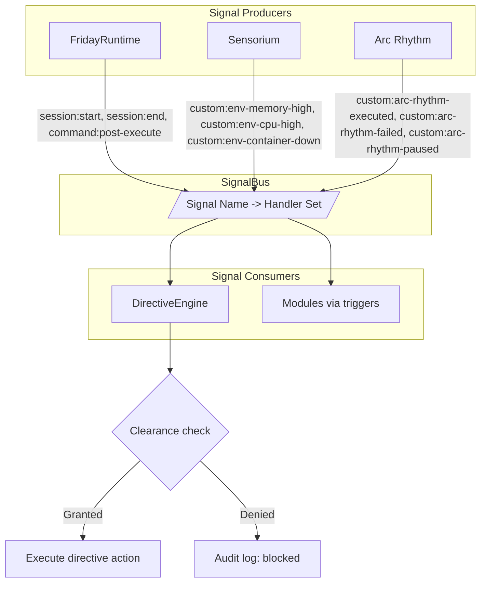

The `SignalName` type uses a **template literal union** — 10 well-known signals (`file:changed`, `test:failed`, `session:start`, etc.) plus a `custom:${string}` catch-all. Any subsystem can mint new signal types at runtime without touching the type definition.

**Design properties:**
- **Error isolation** — each handler runs in its own try/catch. One broken handler can't take down the bus or prevent others from firing
- **Sequential execution** — handlers are awaited in order, preventing race conditions between directive actions and audit logging
- **Dynamic subscriptions** — the DirectiveEngine syncs its subscriptions whenever the DirectiveStore changes, automatically subscribing to signals needed by new directives

The DirectiveEngine is the primary consumer. It watches the DirectiveStore for enabled directives, subscribes to exactly the signals they need, and when a signal fires: finds matching directives → checks clearance → executes the action → logs to audit → increments execution count. **No subsystem imports another.** The bus carries the signal, the engine matches it, the action fires.

---

### 🖥️ TUI — Terminal Interface

The TUI is Friday's primary interactive interface — a full terminal UI built with **OpenTUI** (React for CLI). It's not a readline prompt — it's a React component tree rendered to the terminal with managed state, animations, and mouse support.

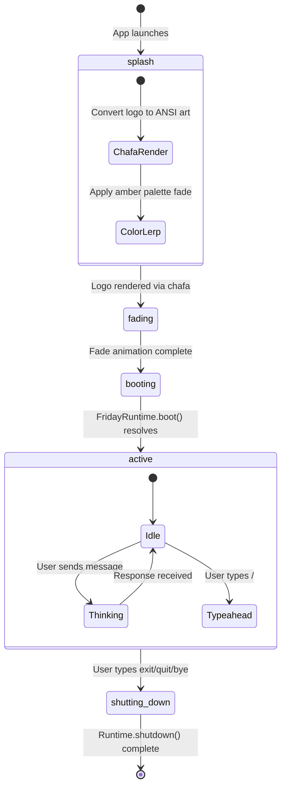

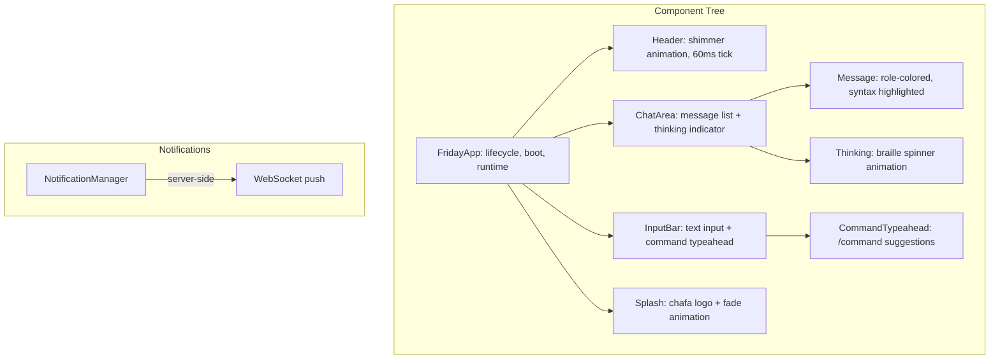

Key UX features:
- **Splash screen** — chafa CLI converts the logo image to ANSI art, then a color-lerp fade animation transitions to the boot phase
- **Shimmer header** — a traveling highlight animation across the "F.R.I.D.A.Y." title (60ms tick, 4s pause cycle)
- **Command typeahead** — typing `/` shows a filtered list of available protocols
- **Mouse text selection** — click and drag to select text, auto-copied to clipboard
- **State machine** — the `appReducer` manages phases (splash → fading → booting → active → shutting-down) with clear transitions, no ambiguous intermediate states

`bun run start chat`

---

### 🌐 Web UI — Browser Interface

The Web UI provides a voice-focused browser interface to Friday over WebSocket. The React frontend (Vite + Tailwind) connects to a `Bun.serve()` backend that routes messages through the same `FridayRuntime` as the TUI — same Cortex, same modules, same knowledge. The UI has been redesigned around voice interaction, with an embedded terminal for text-based chat.

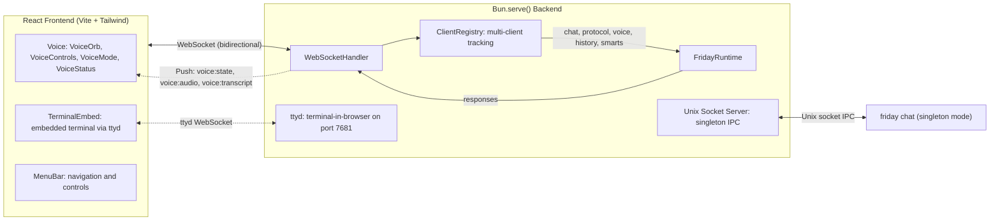

The WebSocket protocol supports: `session:boot`, `session:shutdown`, `chat`, `protocol`, `history:list`, `history:load`, `smarts:list`, `smarts:search`, `voice:start`, `voice:stop`, `voice:mode`, and `session:identify` for client-type registration. The server is the **single source of truth** — `friday chat` requires a running server and connects via `SocketBridge` over `~/.friday/friday.sock`. If no server is running, `friday chat` exits with a helpful error.

`bun run serve` · `bun run web:dev`

---

### ⏱️ Arc Rhythm — Autonomous Scheduling

Arc Rhythm is Friday's **heartbeat** — the autonomous scheduling subsystem that lets her execute recurring tasks headlessly. Define a rhythm with a cron expression, and Friday will execute it through Cortex (LLM reasoning), tool calls (direct execution), or protocol dispatches (slash commands) — all persisted to SQLite with full execution history.

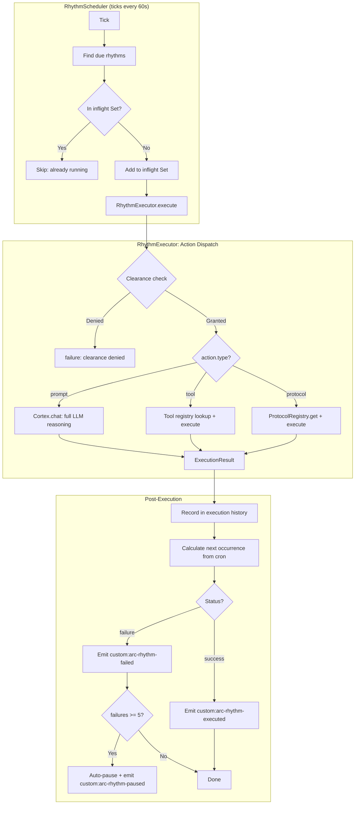

The built-in **cron parser** is zero-dependency and supports: 5-field expressions, ranges (`1-5`), lists (`MON,WED,FRI`), steps (`*/15`), named days/months (`JAN`, `MON`), and shorthands (`@hourly`, `@daily`, `@weekly`, `@monthly`).

**Dual access pattern:**
- **Humans** use the `/arc` protocol: `/arc create "0 9 * * MON-FRI" run morning standup`
- **Friday herself** uses the `manage_rhythm` tool — she can self-schedule recurring tasks through Cortex

The **reentrant guard** (inflight `Set`) prevents a slow-running rhythm from being double-dispatched on the next tick. **Auto-pause** disables a rhythm after 5 consecutive failures and emits a signal + notification so both the directive system and the user are informed.

`/arc list` · `/arc create "cron" description` · `/arc show <id>` · `/arc pause <id>` · `/arc resume <id>` · `/arc history [id]` · `/arc delete <id>` · `/arc run`

---

### 💬 Conversation History

Sessions persist to SQLite and form the backbone of Friday's long-term memory. Each session captures the full message transcript, provider/model used, timestamps, and an auto-generated summary.

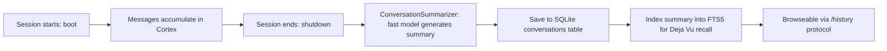

The conversation table is capped at 500 sessions with oldest-first eviction. Summaries are generated by the **fast model** (not the reasoning model) to keep shutdown snappy.

`/history list` · `/history show <id>` · `/history clear`

---

### 🗣️ Vox — Voice Output

Vox is Friday's **voice** — her mouth. Using the xAI Grok Voice Agent API via persistent WebSocket, she can speak responses aloud. This isn't text-to-speech bolted on as an afterthought — it's an integrated subsystem with content-aware prompting, idle eviction, emotional rewriting, and four operational modes.

```mermaid
flowchart TB
    subgraph Modes ["Voice Modes"]
        OFF["Off (default)"]
        ON["On — speak all responses"]
        WHISPER["Whisper — reduced volume"]
        FLAT["Flat — literal TTS, no emotional rewrite"]
    end

    subgraph Pipeline ["TTS Pipeline"]
        A[Cortex returns response] --> B{Vox mode?}
        B -->|Off| SKIP[No audio]
        B -->|On / Whisper| C[classifyContent]
        C --> D["Detect: code, tables, lists, URLs"]
        D --> E[buildTtsPrompt]
        E --> F["Dynamic TTS instructions per utterance"]
        F --> G[WebSocket to Grok Voice API]
        G --> H[PCM16 audio chunks]
        H --> I[pcmToWav: 44-byte WAV header]
        I --> J[detectPlayer: afplay / paplay / PowerShell]
        J --> K[Play audio]
    end

    subgraph Lifecycle ["WebSocket Lifecycle"]
        L[First speak call] --> M[Open WebSocket]
        M --> N[60s idle timer starts]
        N --> O{New speak?}
        O -->|Yes| P[Reset idle timer]
        O -->|No, timeout| Q[Close WebSocket]
    end
```

The **dynamic TTS prompt system** is the key innovation: `classifyContent()` detects what kind of content Friday is about to speak (tables, code blocks, bullet lists, URLs) and `buildTtsPrompt()` injects specific instructions for that utterance. A table gets "summarize the data verbally", while code gets "describe the code's purpose, don't read syntax aloud". The voice identity (`FRIDAY_VOICE_IDENTITY`) specifies a Kerry Condon-inspired County Tipperary Irish accent.

**VoiceSessionManager** (`src/core/voice/session-manager.ts`) provides a separate conversational voice interface — connecting to the Grok Realtime API via `ws.ts` for bidirectional audio conversations, with a state machine (idle → listening → thinking → speaking → error). Routes transcripts through `cortex.chatStreamVoice()` with barge-in support (cancels in-flight responses on VAD speech detection).

| Feature | Detail |
|---|---|
| Fire-and-forget | `vox.speak(text).catch(() => {})` — never blocks Cortex response |
| Persistent WebSocket | Stays open between utterances, 60s idle eviction |
| Content classification | Tables, code, lists, URLs get tailored TTS instructions |
| Emotional rewrite | Fast model rewrites text with mood-appropriate auditory cues ([laugh], [sigh], [pause]) |
| Platform audio | `afplay` (macOS), `paplay` (Linux), PowerShell (Windows) |
| VoiceChannel | Bridges NotificationManager into speech |
| 5 voices | Ara, Eve (default), Rex, Sal, Leo — override with `FRIDAY_VOICE` |

`/voice on` · `/voice off` · `/voice whisper` · `/voice test` · `/voice status`

---

### 🪪 Genesis — Identity Prompt

Genesis is Friday's **identity** — the personality prompt that defines who she is. Unlike hardcoded system prompts, Genesis lives as an editable file at `~/.friday/GENESIS.md`, loaded at boot and injected into every Cortex conversation. The BOSS controls it; Friday cannot modify it.

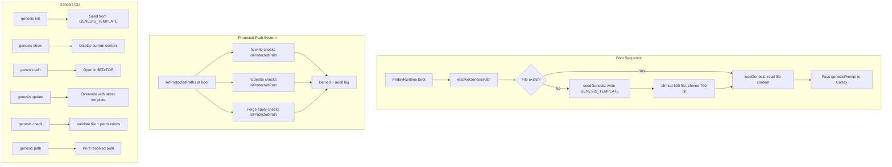

| Feature | Detail |
|---|---|
| Location | `~/.friday/GENESIS.md` (override: `FRIDAY_GENESIS_PATH`) |
| Permissions | Directory: 700, File: 600 — enforced on seed and every boot |
| Seed template | `GENESIS_TEMPLATE` in `src/core/prompts.ts` |
| Protection | `isProtectedPath()` blocks writes from filesystem tools and Forge |
| Audit | `genesis:write-denied` logged on blocked write attempts |

`friday genesis show` · `friday genesis init` · `friday genesis edit` · `friday genesis update` · `friday genesis check` · `friday genesis path`

---

### 🛡️ Clearance & Audit — Trust but Verify

Every tool call, directive execution, and module action in Friday passes through a **permission gate** before it can execute. The ClearanceManager maintains a set of granted permissions, and every action must declare what it needs.

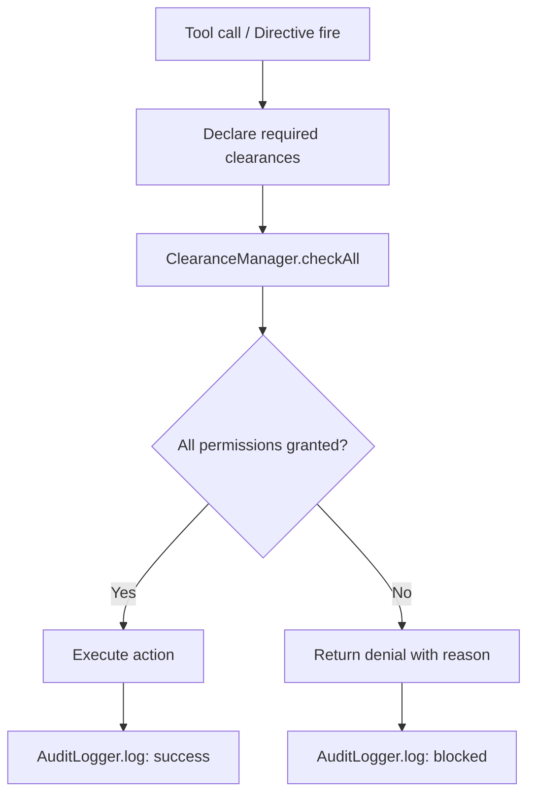

**12 clearance types** control every capability boundary:

| Clearance | What It Gates |
|---|---|
| `read-fs` | Reading files from the filesystem |
| `write-fs` | Writing or creating files |
| `delete-fs` | Deleting files |
| `exec-shell` | Running shell commands |
| `network` | Making HTTP requests |
| `git-read` | Git read operations (status, diff, log) |
| `git-write` | Git write operations (push, branch, stash) |
| `provider` | Calling the LLM provider |
| `system` | System-level operations (restart, env access) |
| `forge-modify` | Creating or patching forge modules |
| `email-send` | Sending or replying to emails |
| `audio-output` | Playing audio / voice output via Vox |

The **AuditLogger** records every action with structured entries: `action` (what happened), `source` (who did it), `detail` (human-readable description), `success` (boolean), and optional `metadata` (signal name, directive ID, etc.). This creates a complete trail of everything Friday does.

---

## MCU Concept Map

The architecture borrows its vocabulary from the MCU. Each subsystem maps to something in Tony Stark's world:

| MCU Concept | Framework Name | What It Does |
|---|---|---|
| Friday's brain | **Cortex** | LLM reasoning, conversation memory, tool orchestration |
| "Activate Protocol X" | **Protocol** | Named slash command executed without LLM reasoning |
| Standing orders | **Directive** | Autonomous rule triggered by signals or schedules |
| Suit module | **Module** | Bundled capability (tools + protocols + knowledge) |
| Suit function | **Tool** | Single executable action within a module |
| Event sensors | **Signal** | Internal event that triggers directives and modules |
| Security clearance | **Clearance** | Permission gate for tools, directives, and modules |
| Identity template | **Genesis** | Friday's personality — loaded from `~/.friday/GENESIS.md` |
| Mission log | **Audit Log** | Record of every action, reason, and result |
| Alert system | **Notification** | Multi-channel alerts (terminal, Slack, webhook) |
| Field knowledge | **SMARTS** | Dynamic knowledge base — learns from conversations |
| Sensor suite | **Sensorium** | Environmental awareness — machine, Docker, dev tools |
| The workshop | **Forge** | Self-improvement — Friday authors and patches her own modules |
| Heads-up display | **TUI** | Interactive terminal interface — boot splash, shimmer header, chat |
| "I remember when..." | **Deja Vu** | Conversational memory recall — FTS5 search across past sessions |
| Heartbeat / scheduler | **Arc Rhythm** | Autonomous scheduled task execution — cron-driven, headless |
| Email identity | **Gmail** | Email via Gmail API — search, read, send, reply with OAuth 2.0 |
| Friday's voice | **Vox** | Voice output via Grok Voice Agent API — fire-and-forget TTS, content-aware prompts, emotional rewriting |

---

## Architecture

### System Topology

How all subsystems wire together through the FridayRuntime composition root:

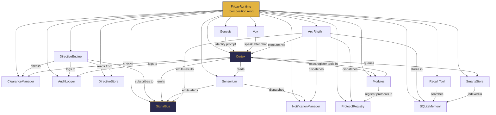

### Boot Sequence

FridayRuntime boots subsystems in strict dependency order. Each step depends on what came before:

```mermaid
flowchart LR
    A[SignalBus] --> B[ClearanceManager]
    B --> C[AuditLogger]
    C --> D[NotificationManager]
    D --> E[ProtocolRegistry]
    E --> F["DirectiveStore +<br/>DirectiveEngine"]
    F --> G[SQLiteMemory]
    G --> H[SmartsStore]
    H --> I[Sensorium]
    I --> GEN[Genesis]
    GEN --> VOX[Vox]
    VOX --> J[Cortex]
    J --> K[Recall Tool]
    K --> L["Arc Rhythm<br/>(store + executor + scheduler)"]
    L --> M[Module Discovery]
    M --> N[Forge Module Discovery]
    N --> O["Emit session:start"]
```

### Process Loop

How user input flows through the runtime:

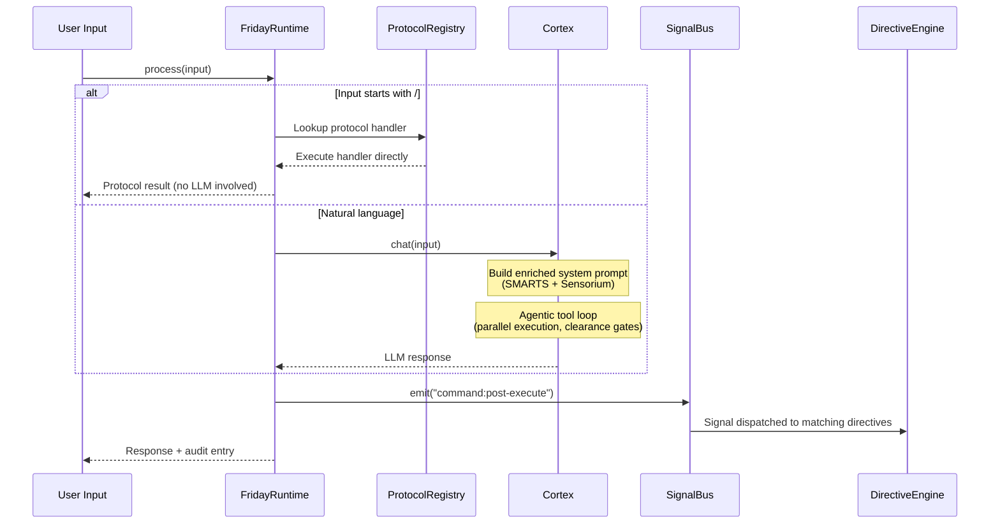

---

## CLI Usage

```bash
# Start the server (must be running before chat)
bun run serve                  # Start Friday server (default port 3000)
friday serve &                 # Or run in background after `bun link`

# Connect with the TUI (requires running server)
bun run start chat             # Connect to running server via TUI
friday chat                    # Or after `bun link`

# Model overrides are configured on the server, not the chat client
# Use --model and --fast-model flags on `friday serve` (or env vars)

# Manage Friday's identity prompt
bun run start genesis init     # Seed GENESIS.md from template
bun run start genesis show     # Print current identity prompt
bun run start genesis edit     # Open GENESIS.md in $EDITOR
bun run start genesis update   # Overwrite with latest template
bun run start genesis check    # Validate file + permissions
bun run start genesis path     # Print resolved file path

# Debug inference logging (server-side)
friday --debug serve           # Debug mode — logs inference payloads and responses
```

### In-Session Commands

| Input | Behavior |
|---|---|
| Natural language | Sent to Cortex for LLM reasoning |
| `/command [args]` | Routed directly to a registered Protocol |
| `/smart list` | List all knowledge entries |
| `/smart search <query>` | FTS5 search across SMARTS knowledge |
| `/smart domains` | Show knowledge domains |
| `/env status` | Full environment snapshot |
| `/env cpu` / `/env memory` | System resource details |
| `/env docker` | Running container status |
| `/env git` | Git repository state |
| `/history list` | Browse past conversation sessions |
| `/history show <id>` | View a specific session |
| `/history clear` | Delete all saved sessions |
| `/forge list` | List all forge-authored modules |
| `/forge status <name>` | Detailed health of a forge module |
| `/forge history <name>` | Version history of a forge module |
| `/forge protect <name>` | Mark a forge module as immutable |
| `/forge unprotect <name>` | Remove protection from a forge module |
| `/forge manifest` | Dump raw forge manifest.json |
| `/forge help` | Show forge subcommand reference |
| `/arc list` | List all scheduled rhythms |
| `/arc create "cron" desc` | Create a new scheduled rhythm |
| `/arc show <id>` | Detailed view of a rhythm |
| `/arc pause <id>` / `resume` | Pause or resume a rhythm |
| `/arc history [id]` | View execution history |
| `/arc delete <id>` | Remove a rhythm |
| `/arc run` | Trigger a manual scheduler tick |
| `/gmail inbox` | View recent inbox messages |
| `/gmail search <query>` | Search emails |
| `/gmail read <id>` | Read a specific email |
| `/gmail send` | Compose and send an email |
| `/gmail labels` | List Gmail labels |
| `/voice on` / `off` / `whisper` | Set voice output mode |
| `/voice flat` | Literal TTS — no emotional rewrite |
| `/voice test` | Speak a test phrase |
| `/voice status` | Show voice system status |
| `exit`, `quit`, `bye` | Ends the session |

### Model Defaults

Friday uses a **dual-model architecture**: a reasoning model for conversations and a fast model for utility tasks (summarization, knowledge extraction). Both models are powered by xAI Grok.

| Role | Default Model |
|---|---|
| Reasoning | `grok-4-1-fast-reasoning-latest` |
| Fast | `grok-4-1-fast-non-reasoning` |

Resolution priority: CLI flag (`--model` / `--fast-model`) > env var (`FRIDAY_REASONING_MODEL` / `FRIDAY_FAST_MODEL`) > `GROK_DEFAULTS`.

---

## Creating a Module

Modules are the primary extension point. A module bundles tools, protocols, knowledge, and signal triggers into a discoverable unit.

```typescript
import type { FridayModule } from "../modules/types.ts";

const myModule: FridayModule = {
  name: "my-module",
  description: "Does something useful",
  version: "1.0.0",
  tools: [
    {
      name: "my-tool",
      description: "Performs an action",
      parameters: [
        { name: "target", type: "string", description: "What to act on", required: true },
      ],
      clearance: ["read-fs"],
      execute: async (args, context) => {
        context.audit.log({
          action: "my-tool:run",
          source: "my-module",
          detail: `Acting on ${args.target}`,
          success: true,
        });
        return { success: true, output: `Done with ${args.target}` };
      },
    },
  ],
  protocols: [],
  knowledge: [],
  triggers: ["file:changed"],
  clearance: ["read-fs"],

  async onLoad() {
    // Called when the module is loaded at boot
  },

  async onUnload() {
    // Called during runtime shutdown
  },
};

export default myModule;
```

---

## Environment Setup

```bash
cp .env.example .env
```

```env
# Required — xAI API key for Grok
XAI_API_KEY=xai-...

# Optional: Override reasoning model (CLI: --model)
FRIDAY_REASONING_MODEL=grok-4-1-fast-reasoning-latest

# Optional: Override fast model for utility tasks (CLI: --fast-model)
FRIDAY_FAST_MODEL=grok-4-1-fast-non-reasoning

# Optional: Gmail module (OAuth 2.0)
GOOGLE_CLIENT_ID=...
GOOGLE_CLIENT_SECRET=...

# Optional: Fallback master key for SecretStore (when OS keychain unavailable)
FRIDAY_SECRET_KEY=...

# Optional: Override identity prompt path (default: ~/.friday/GENESIS.md)
FRIDAY_GENESIS_PATH=...

# Optional: Override voice (default: Eve). Available: Ara, Eve, Rex, Sal, Leo
FRIDAY_VOICE=Eve

# Optional: Notification webhooks
FRIDAY_SLACK_WEBHOOK_URL=https://hooks.slack.com/services/...
FRIDAY_WEBHOOK_URL=https://example.com/webhook
FRIDAY_EMAIL_WEBHOOK_URL=https://example.com/email-webhook
```

Bun loads `.env` automatically — no dotenv needed.

---

## Development

```bash
bun run dev              # Auto-restart on file changes
bun test                 # Run all tests (1129 tests across 105 files)
bun test --watch         # Watch mode
bun test tests/unit/cortex.test.ts  # Single test file
bun run lint             # Lint check
bun run lint:fix         # Lint and auto-fix
bun run format           # Format source files
bun run typecheck        # TypeScript type checking
bun run serve            # Start Friday web UI server (port 3000)
bun run web:dev          # Start Vite dev server for frontend (port 5173)
bun run web:build        # Build frontend for production
```

### Project Structure

```
src/
├── main.ts                # Entrypoint — CLI bootstrap
├── cli/
│   ├── index.ts           # Commander program definition

│   ├── commands/          # One file per CLI command (chat.ts delegates to TUI)
│   └── tui/               # OpenTUI terminal interface (React for CLI)
│       ├── app.tsx         # FridayApp root — lifecycle, boot, runtime integration
│       ├── state.ts        # AppState reducer, Message types, phase state machine
│       ├── theme.ts        # Friday amber palette, SyntaxStyle definitions
│       ├── filter-commands.ts  # Command typeahead filtering
│       ├── log-store.ts   # LogStore — state for TUI debug log panel
│       ├── log-types.ts   # LogEntry types for structured log display
│       ├── components/    # Header, ChatArea, InputBar, Message, Splash, Thinking, Welcome, LogPanel
│       └── lib/           # ANSI parser, color utils, chafa logo processor, usePulse hook
├── core/
│   ├── cortex.ts          # LLM brain — chat(), chatStream() (TextWorker), chatStreamVoice() (VoiceWorker)
│   ├── history-manager.ts # Token-budget conversation history with compaction
│   ├── stream-types.ts    # ChatStream, VoiceChatStream interfaces
│   ├── tool-bridge.ts     # Portable tool bridge — buildToolDefinitions, createToolExecutor, toGrokTools
│   ├── workers/           # CortexWorker implementations
│   │   ├── types.ts        # CortexWorker interface, WorkerRequest, WorkerResult, ToolEvent
│   │   ├── text-worker.ts  # TextWorker — AI SDK streamText() agent loop
│   │   ├── voice-worker.ts # VoiceWorker — Grok realtime WebSocket agent loop
│   │   └── push-iterable.ts # Push-based AsyncIterable utility
│   ├── summarizer.ts      # Session summaries via fast model
│   ├── runtime.ts         # Boot/shutdown orchestrator
│   ├── events.ts          # SignalBus — typed event system
│   ├── clearance.ts       # Permission gates (12 clearance types)
│   ├── memory.ts          # SQLite persistence, FTS5 search, conversation indexing
│   ├── recall-tool.ts     # recall_memory tool — conversation memory search (Deja Vu)
│   ├── genesis.ts         # Identity prompt loader (~/.friday/GENESIS.md)
│   ├── secrets.ts         # SecretStore — AES-256-GCM encrypted storage
│   ├── notifications.ts   # Multi-channel notification system
│   ├── types.ts           # Core TypeScript interfaces
│   ├── prompts.ts         # GENESIS_TEMPLATE — seed template for identity prompt
│   ├── bridges/           # Runtime bridge abstractions for singleton mode
│   │   ├── socket.ts      # SocketBridge — Unix socket IPC to running server
│   │   └── types.ts       # RuntimeBridge interface
│   └── voice/             # Vox — voice output and realtime conversational voice
│       ├── vox.ts         # Vox class — fire-and-forget TTS, idle eviction
│       ├── session-manager.ts # VoiceSessionManager — thin audio I/O + lifecycle (replaces VoiceBridge)
│       ├── audio.ts       # pcmToWav, detectPlayer, playAudio
│       ├── prompt.ts      # classifyContent, buildTtsPrompt, FRIDAY_VOICE_IDENTITY
│       ├── narration.ts   # NarrationPicker, ACK_PHRASES, TOOL_NARRATIONS — Vox notification TTS phrases
│       ├── channel.ts     # VoiceChannel — notification bridge
│       ├── emotion.ts     # emotionalRewrite() — conversation-aware TTS rewriting
│       ├── ws.ts          # openGrokWebSocket() — authenticated Grok realtime WebSocket factory
│       ├── protocol.ts    # /voice protocol (on, off, whisper, flat, test, status)
│       └── types.ts       # VoiceMode (off/on/whisper/flat), EmotionMood, EmotionProfile, GrokVoice, VoxConfig
├── audit/                 # Action tracking and filtering
├── modules/
│   ├── types.ts           # FridayModule, FridayTool interfaces
│   ├── loader.ts          # Module discovery and validation
│   ├── validation.ts      # Shared argument validation (SSRF protection, flag injection guards)
│   ├── filesystem/        # Read, write, list, delete, exec tools
│   ├── git/               # Git operations (status, diff, log, branch, stash, push, pull)
│   ├── docker/            # Docker management (ps, logs, inspect, stats, exec)
│   ├── code-exec/         # Sandboxed script execution
│   ├── web-fetch/         # HTTP requests with SSRF protection
│   ├── notify/            # Multi-channel notification dispatch
│   ├── forge/             # The Forge — self-improvement system
│   └── gmail/             # Gmail — email via OAuth 2.0
├── protocols/             # Protocol registry and routing
├── directives/            # Autonomous rule engine
├── smarts/
│   ├── types.ts           # SmartEntry, SmartsConfig types
│   ├── parser.ts          # YAML frontmatter parser/serializer
│   ├── store.ts           # FTS5-indexed knowledge base
│   ├── protocol.ts        # /smart protocol handler
│   └── curator.ts         # Autonomous knowledge extraction
├── sensorium/
│   ├── types.ts           # SystemSnapshot, SensorConfig types
│   ├── sensors.ts         # Pure sensor functions (machine, Docker, dev)
│   ├── sensorium.ts       # Polling loop, alerts, context block
│   ├── format.ts          # Formatting utilities for snapshot display
│   ├── protocol.ts        # /env protocol handler
│   └── tool.ts            # LLM-accessible environment tool
├── arc-rhythm/
│   ├── types.ts           # Rhythm, RhythmAction, RhythmExecution, constants
│   ├── cron.ts            # Built-in cron parser: validate, nextOccurrence, describe
│   ├── store.ts           # RhythmStore — SQLite CRUD, execution tracking
│   ├── executor.ts        # Dispatches prompt/tool/protocol actions
│   ├── scheduler.ts       # Polling loop, reentrant guard, auto-pause
│   ├── protocol.ts        # /arc protocol handler
│   └── tool.ts            # manage_rhythm FridayTool for Cortex
├── history/
│   └── protocol.ts        # /history protocol (list, show, clear)
├── server/
│   ├── index.ts           # Bun.serve() HTTP + WebSocket server
│   ├── protocol.ts        # Shared message types (ClientMessage, ServerMessage, voice messages)
│   ├── handler.ts         # WebSocket message routing to FridayRuntime
│   ├── session-hub.ts     # SessionHub — session lifecycle, hydration, cross-client sync
│   ├── client-registry.ts # ClientRegistry — multi-client WebSocket tracking
│   ├── socket.ts          # Unix socket server for singleton IPC (~/.friday/friday.sock)
│   ├── ttyd.ts            # Terminal-in-browser support (spawns ttyd on port 7681)
│   └── push-channel.ts    # PushNotificationChannel — bridges notifications to WebSocket/socket clients
├── providers/             # Grok model factory (createModel, Zod schema converter, debug-log)
└── utils/
    └── timeout.ts         # Shared timeout utilities
web/                       # React web UI (Vite + Tailwind) — voice-focused architecture
├── src/
│   ├── components/
│   │   ├── voice/         # VoiceControls, VoiceOrb, VoiceMode, VoiceStatus
│   │   ├── terminal/      # TerminalEmbed — embedded terminal via ttyd
│   │   └── menu/          # MenuBar — navigation and controls
│   ├── hooks/             # useVoiceAudio, useVoiceSession
│   └── index.css          # Tailwind theme (Friday amber palette)
tests/
├── helpers/               # Shared test stubs (createMockModel, createErrorModel)
├── unit/                  # Unit tests (bun:test)
└── integration/           # Integration tests — future
```

---

## Docker

```bash
# Build
docker build -t friday .

# Run (starts the server — default entrypoint)
docker run -p 3000:3000 -e XAI_API_KEY=xai-... friday
```

---

## Tech Stack

| Component | Technology |
|---|---|
| Runtime | [Bun](https://bun.sh) |
| Language | TypeScript (strict mode) |
| AI SDK | [Vercel AI SDK v6](https://sdk.vercel.ai) (`ai`, `@ai-sdk/xai`) — Grok provider |
| CLI Framework | [Commander.js](https://github.com/tj/commander.js) |
| Terminal UI | [OpenTUI](https://github.com/anthropics/claude-code-openui) (`@opentui/react`) — React for CLI |
| Web UI | React + [Vite](https://vite.dev) + [Tailwind CSS](https://tailwindcss.com) |
| Database | SQLite via `bun:sqlite` (KV, conversations, FTS5 search) |
| Knowledge | SMARTS — YAML frontmatter + FTS5-indexed markdown |
| Monitoring | Sensorium — dual-cadence polling with alert hysteresis |
| Linter/Formatter | [Biome](https://biomejs.dev) |
| CLI UX | chalk (colors), OpenTUI components, chafa (logo art) |
| Container | Docker (`oven/bun:1`) |

---

## License

Private project. Not published to any package registry.
